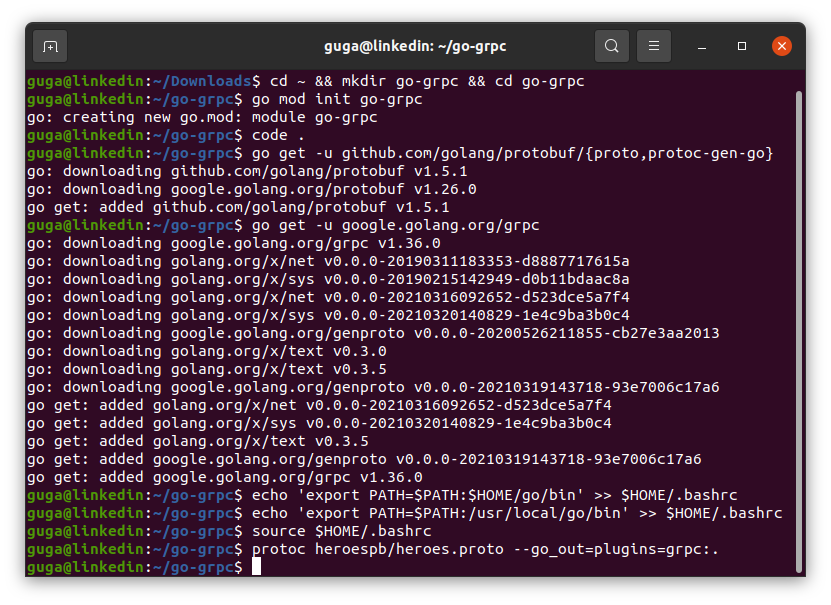
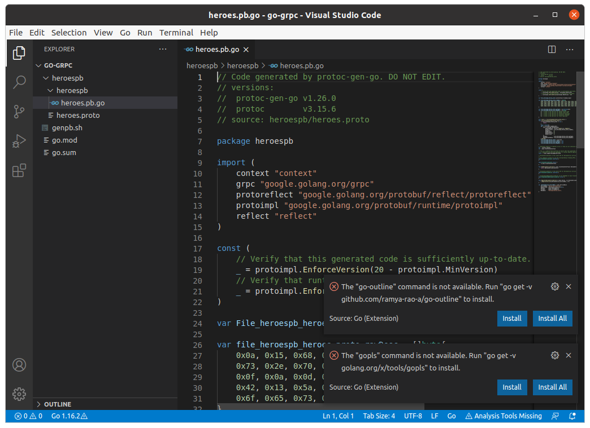
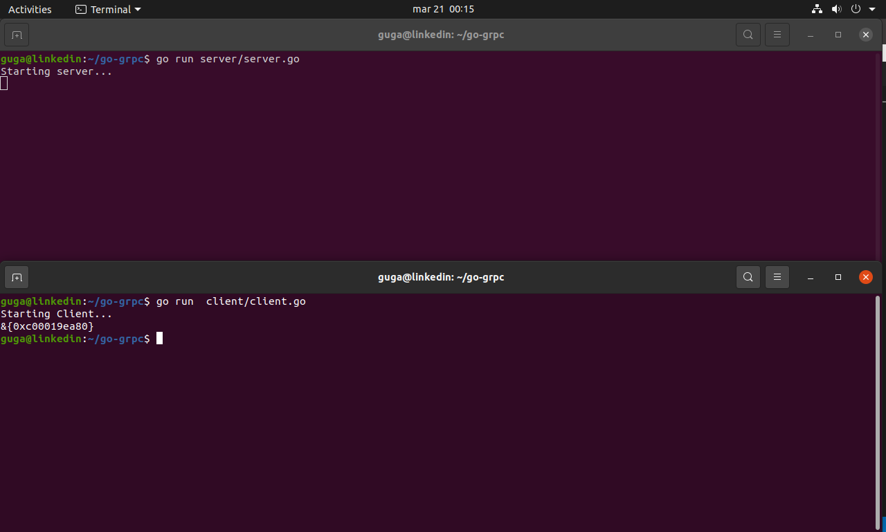
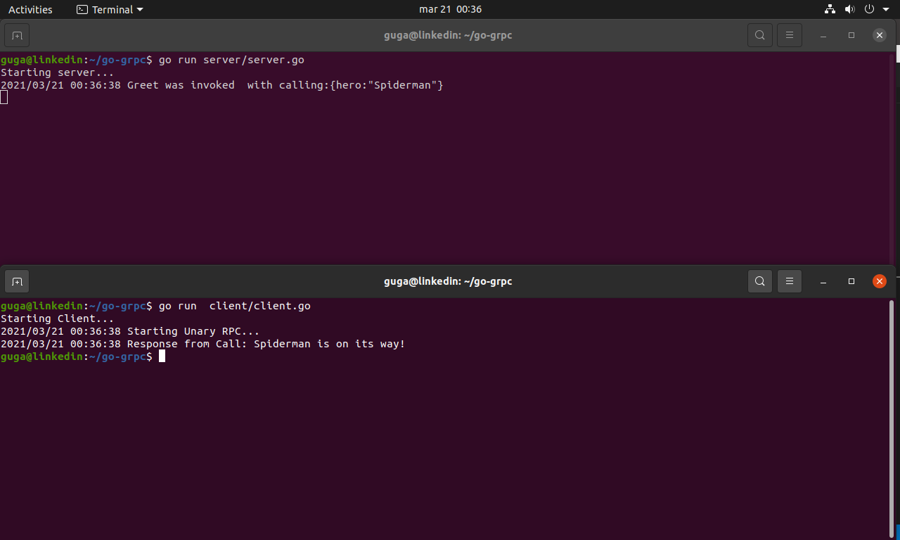

Linkedin Article: https://www.linkedin.com/pulse/grpc-go-jos%25C3%25A9-augusto-zimmermann-negreiros

# gRPC

### Wikipedia

gRPC (gRPC Remote Procedure Calls) is an open source remote procedure call (RPC) system initially developed at Google in 2015. It uses HTTP/2 for transport, Protocol Buffers as the interface description language, and provides features such as authentication, bidirectional streaming and flow control, blocking or nonblocking bindings, and cancellation and timeouts. It generates cross-platform client and server bindings for many languages. Most common usage scenarios include connecting services in a microservices style architecture, or connecting mobile device clients to backend services.

https://en.wikipedia.org/wiki/GRPC

### Google

gRPC is a modern open source high performance Remote Procedure Call (RPC) framework that can run in any environment. It can efficiently connect services in and across data centers with pluggable support for load balancing, tracing, health checking and authentication. It is also applicable in last mile of distributed computing to connect devices, mobile applications and browsers to backend services.

*The main usage scenarios*
- Efficiently connecting polyglot services in microservices style architecture
- Connecting mobile devices, browser clients to backend services
- Generating efficient client libraries

*Core features that make it awesome*
- Idiomatic client libraries in 10 languages
- Highly efficient on wire and with a simple service definition framework
- Bi-directional streaming with http/2 based transport
- Pluggable auth, tracing, load balancing and health checking

*Who’s using gRPC and why?*

Many companies are already using gRPC for connecting multiple services in their environments. The use case varies from connecting a handful of services to hundreds of services across various languages in on-prem or cloud environments.

- Square
- Netflix
- CoreOS
- Cockroach Labs
- Cisco
- Juiniper Networks

*The story behind gRPC*
gRPC was initially created by Google, which has used a single general-purpose RPC infrastructure called Stubby to connect the large number of microservices running within and across its data centers for over a decade. In March 2015, Google decided to build the next version of Stubby and make it open source. The result was gRPC, which is now used in many organizations outside of Google to power use cases from microservices to the “last mile” of computing (mobile, web, and Internet of Things).

For more - https://grpc.io/blog/

# gRPC with GO

See in my Protobuf article (https://www.linkedin.com/pulse/google-protocol-buffers-3-go-jos%25C3%25A9-augusto-zimmermann-negreiros) how to install GO, Protoc and VSCode (plus extensions).

## Start Coding

First, we need to test the tools to see if everything is running right to not have future problems.

So let's create a project, from your home folder:

```bash
cd ~ && mkdir go-grpc && cd go-grpc
```

This will be now your root folder, and since we are not running inside GO's default project folder, let's just start a go module:

```Bash
go mod init go-grpc
```

Open VSCode `code .` and create the first file `heroespb/heroes.proto`

```Protobuf
syntax = "proto3";

package heroes;

option go_package = "heroespb/heroespb";

service HeroesService {};
```

We just created a `.proto` file, so we need support to Protobuf (https://github.com/golang/protobuf) and `gRPC-Go` (https://github.com/grpc/grpc-go): 

```Bash
guga@linkedin:~$ go get -u github.com/golang/protobuf/{proto,protoc-gen-go}
guga@linkedin:~$ go get -u google.golang.org/grpc
guga@linkedin:~$ echo 'export PATH=$PATH:$HOME/go/bin' >> $HOME/.bashrc
guga@linkedin:~$ echo 'export PATH=$PATH:/usr/local/go/bin' >> $HOME/.bashrc
guga@linkedin:~$ source $HOME/.bashrc
```

It's may take a long to finish.



To generate the code:

```Bash
protoc heroespb/heroes.proto --go_out=plugins=grpc:.
```

protoc receive first the file relative path of the file, than since we are using GO we need the --go_out and tell that we are using the plugin grpc.

We will use this command a lot of times so will be good to create a `.sh` file with it `genpb.sh`:

```sh
#!/bin/bash

protoc heroespb/heroes.proto --go_out=plugins=grpc:.
```

And turn it to a executable `chmod +x genpb.sh`


Now if everithing worked we have the file `heroespb/heroespb/heroes.pb.go` with the auto generated code... but when you first open the file, VSCode may ask a lot of stuff... just click install all to everything, after it run `go get all` just to make sure everything is ok.



Let's create a test server and client to make sure the code generated is ok.

`server/server.go` -> I will call this file just SERVER
```Go
package main

import (
	"fmt"
	"go-grpc/heroespb/heroespb"
	"log"
	"net"

	"google.golang.org/grpc"
)

type server struct{}

func main() {
	fmt.Println("Starting server...")

	l, err := net.Listen("tcp", "0.0.0.0:50051")
	if err != nil {
		log.Fatalf("Failed to listen %v", err)
	}
	s := grpc.NewServer()
	heroespb.RegisterHeroesServiceServer(s, &server{})
	if err := s.Serve(l); err != nil {
		log.Fatalf("Failed to server %v", err)
	}
}

```

In this file we create a empty server struct (gRPC black magic), then we listen the port 50051 (default to gRPC) and start the server.

`client/client.go` -> I will call this file just CLIENT
```Go
package main

import (
	"fmt"
	"go-grpc/heroespb/heroespb"
	"log"

	"google.golang.org/grpc"
)

func main() {
	fmt.Println("Starting Client...")
	cc, err := grpc.Dial("localhost:50051", grpc.WithInsecure())
	if err != nil {
		log.Fatalf("Could not connect: %v", err)
	}
	defer cc.Close()
	c := heroespb.NewHeroesServiceClient(cc)
	fmt.Println(c)
}

```

And in this file we create a new Dial to the server (`WithInsecure` is because we are not using SSL) and start the Heroes Service (`defer` will close the server connection after we use it).

To test we can open two terminals, in the first one run `go run server/server.go` and in the other `go run client/client.go`.



If you see no error all is running good and we can continue. 

## Unary Server

This type of API the client will send ONE request, and the server will return ONE response.

In your `.proto` change to: 

```Protobuf
syntax = "proto3";

package heroes;

option go_package = "heroespb/heroespb";

message Calling { string hero = 1; }

message CallRequest { Calling calling = 1; }

message CallResponse { string result = 1; }

service HeroesService{
 // Unary Server
 rpc Call (CallRequest) returns (CallResponse) {};
};
```
Service HeroesService now have Call, that send Request and receive a Response.

Since we changed the `.proto` file we need to generate the code again, this will be done everytime we change the `.proto`.

```bash
guga@linkedin:~/go-grpc$ ./genpb.sh 
```

in CLIENT remove `fmt.Println(c)` and add `doUnary(c)`, and create the function:

```Go
func doUnary(c heroespb.HeroesServiceClient) {
	log.Println("Starting Unary RPC...")
	req := &heroespb.CallRequest{
		Calling: &heroespb.Calling{
			Hero: "Spiderman",
		},
	}

	res, err := c.Call(context.Background(), req)
	if err != nil {
		log.Fatalf("Error Call RPC: %v", err)
	}
	log.Printf("Response from Call: %v\n", res.Result)
}
```

This func is pretty straightforward, we create a request and call to the server with the request.

And in SERVER:

```Go
func (*server) Call(ctx context.Context, req *heroespb.CallRequest) (*heroespb.CallResponse, error) {
	log.Printf("Greet was invoked with %v\n", req)
	hero := req.GetCalling().GetHero()
	result := hero + " is on its way!"
	res := &heroespb.CallResponse{
		Result: result,
	}
	return res, nil
}
```

Simple, we just receive the request, create the result and send back to the client.



## Server Streaming

This type of API the client will send ONE request, and the server will return MANY responses.

In your `.proto` add this two messages: 

```Protobuf
message CallTeamRequest { Calling calling = 1; }

message CallTeamResponse { string result = 1; }
```

and inside `HeroesService`:

```Protobuf
// Server Streaming
rpc CallTeam(CallTeamRequest) returns (stream CallTeamResponse) {};
```

Service HeroesService now have CallTeam, that have one Request and receive a stream as Response.

Do not forget to generate the code!

```bash
guga@linkedin:~/go-grpc$ ./genpb.sh 
```

in CLIENT comment `doUnary(c)` and add `doServerStreaming(c)`, and create the function

```Go
func doServerStreaming(c heroespb.HeroesServiceClient) {
	log.Println("Starting Server Streaming RPC...")
	req := &heroespb.CallTeamRequest{
		Calling: &heroespb.Calling{
			Hero: "X-Men",
		},
	}

	stream, err := c.CallTeam(context.Background(), req)
	if err != nil {
		log.Printf("Error calling Server Streaming CallTeam RPC: %v", err)
	}
	for {
		res, err := stream.Recv()
		if err == io.EOF {
			break
		}
		if err != nil {
			log.Printf("Error while reading stream: %v", err)
		}
		log.Printf("Response from CallTeam: %v\n", res.GetResult())
	}
}

```

This func create a request and then call the server to start a stream, in this case we will receive more than one response and we need to handle it in a for, if we reach the End Of File we just break the for looping, if not we print the response.

And in SERVER:

```Go
func (*server) CallTeam(req *heroespb.CallTeamRequest, stream heroespb.HeroesService_CallTeamServer) error {
	log.Printf("CallTeam was invoked with %v\n", req)
	hero := req.GetCalling().GetHero()
	xmen := []string{"Cyclops", "Iceman", "Angel", "Beast", "Phoenix"}
	for _, x := range xmen {
		result := fmt.Sprintf("You called the %v! %v is going!!\n", hero, x)
		res := &heroespb.CallTeamResponse{
			Result: result,
		}
		stream.Send(res)
		time.Sleep(1 * time.Second)
	}
	return nil
}

```

We receive the request and send a response as stream with each X-Men(the sleep is just to  have some emotion).


## Client Streaming

This type of API the client will send MANY request, and the server will return ONE responses.

In your `.proto` add this two messages: 

```Protobuf
message CallManyHeroesRequest { Calling calling = 1; }

message CallManyHeroesResponse { string result = 1; }
```

and inside `HeroesService`:

```Protobuf
// Client Streaming
rpc CallManyHeroes(stream CallManyHeroesRequest) returns (CallManyHeroesResponse) {};
```

Service HeroesService now have CallManyHeroes, that have many Requests as a stream and receive one Response.

Do not forget to generate the code!

in CLIENT:

```Go
func doClientStreaming(c heroespb.HeroesServiceClient) {
	log.Println("Starting Client Streaming RPC...")

	stream, err := c.CallManyHeroes(context.Background())
	if err != nil {
		log.Printf("Error while calling CallManyHeroes: %v", err)
	}

	requests := []*heroespb.CallManyHeroesRequest{
		{
			Calling: &heroespb.Calling{
				Hero: "Mister Fantastic",
			},
		},
		{
			Calling: &heroespb.Calling{
				Hero: "Invisible Woman",
			},
		},
		{
			Calling: &heroespb.Calling{
				Hero: "Thing",
			},
		},
		{
			Calling: &heroespb.Calling{
				Hero: "Human Torch",
			},
		},
	}

	for _, req := range requests {
		stream.Send(req)
		time.Sleep(1 * time.Second)
	}

	res, err := stream.CloseAndRecv()
	if err != nil {
		log.Printf("Error while receiving response from CallManyHeroes: %v", err)
	}

	log.Printf("CallManyHeroes response: %v", res)
}

```

This func send a request for each hero streaming to the server, but we will receive just one response!

SERVER:

```Go
func (*server) CallManyHeroes(stream heroespb.HeroesService_CallManyHeroesServer) error {
	log.Println("CallManyHeroes was invoked with a streaming request")
	result := "You called "
	for {
		req, err := stream.Recv()
		if err == io.EOF {
			return stream.SendAndClose(&heroespb.CallManyHeroesResponse{
				Result: result + "The Fantastic Four!",
			})
		}
		if err != nil {
			log.Printf("Error reading client stream %v\n", err)
		}
		result += req.GetCalling().GetHero() + " - "
	}
}


```
We receive the stream, and when the stream ends the server will send the Fantastic Four! We don't need to wait the EOF to send the response, this can be done at any time, but the server will send just one.


## Bi Directional Streaming

This type of API the client will send MANY request, and the server will return MANY responses.

`.proto`: 

```Protobuf
message CallEveryoneRequest { Calling greeting = 1; }

message CallEveryoneResponse { string result = 1; }
```
```Protobuf
// Bi Directional Streaming
rpc CallEveryone(stream CallEveryoneRequest) returns (stream CallEveryoneResponse) {};
```

Service HeroesService now have CallEveryone, that have many Requests as a stream and receive many Responses as a stream.

CLIENT

```Go
func doBiDirectionalStreaming(c heroespb.HeroesServiceClient) {
	log.Println("Starting Bi Directional Streaming RPC...")

	stream, err := c.CallEveryone(context.Background())
	if err != nil {
		log.Printf("Error while calling CallEveryone: %v", err)
	}

	requests := []*heroespb.CallEveryoneRequest{
		{
			Calling: &heroespb.Calling{
				Hero: "Conan",
			},
		},
		{
			Calling: &heroespb.Calling{
				Hero: "Bêlit",
			},
		},
		{
			Calling: &heroespb.Calling{
				Hero: "Red Sonja",
			},
		},
	}

	// Concurrency
	waitChannel := make(chan struct{})

	// send the messages using GO Routine
	go func() {
		for _, req := range requests {
			log.Printf("Sending req: %v", req)
			stream.Send(req)
			time.Sleep(2 * time.Second)
		}
		stream.CloseSend()
	}()

	// receive messages using GO Routine
	go func() {
		for {
			res, err := stream.Recv()
			if err == io.EOF {
				break
			}
			if err != nil {
				log.Printf("Error while receiving response from CallEveryone: %v", err)
				break
			}
			result := res.GetResult()
			log.Printf("CallEveryone response: %v\n", result)
		}
		close(waitChannel)
	}()

	// block until everything is done
	<-waitChannel
}

```
We create a request for each hero and then open a channel to send the streming to the server, and for each request we will receive back a response. For this we are using GO Concurrency using the Go Routines.

SERVER:

```Go
func (*server) CallEveryone(stream heroespb.HeroesService_CallEveryoneServer) error {
	log.Println("CallEveryone was invoked with a streaming request")

	for {
		req, err := stream.Recv()
		log.Printf("Request: %v:\n", req)
		if err == io.EOF {
			return nil
		}
		if err != nil {
			log.Println("Error reading client stream")
			return err
		}
		hero := req.GetCalling().GetHero()
		result := hero + " is on its way!"
		err = stream.Send(&heroespb.CallEveryoneResponse{
			Result: result,
		})
		if err != nil {
			log.Println("Error while sending data to client")
			return err
		}
	}

}

```
The server part is really simple, just create a for and receive the requests, and send back a response for each request.


# Final Files

`heroespb/heroes.proto`
```Protobuf
syntax = "proto3";

package heroes;

option go_package = "heroespb/heroespb";

message Calling { string hero = 1; }

message CallRequest { Calling calling = 1; }

message CallResponse { string result = 1; }

message CallTeamRequest { Calling calling = 1; }

message CallTeamResponse { string result = 1; }

message CallManyHeroesRequest { Calling calling = 1; }

message CallManyHeroesResponse { string result = 1; }

message CallEveryoneRequest { Calling calling = 1; }

message CallEveryoneResponse { string result = 1; }

service HeroesService {
  // Unary Server
  rpc Call(CallRequest) returns (CallResponse) {};

  // Server Streaming
  rpc CallTeam(CallTeamRequest) returns (stream CallTeamResponse) {};

  // Client Streaming
  rpc CallManyHeroes(stream CallManyHeroesRequest) returns (CallManyHeroesResponse) {};

  // Bi Directional Streaming
  rpc CallEveryone(stream CallEveryoneRequest) returns (stream CallEveryoneResponse) {};
};
```

`client/client.go`
```Go
package main

import (
	"context"
	"fmt"
	"go-grpc/heroespb/heroespb"
	"io"
	"log"
	"time"

	"google.golang.org/grpc"
)

func main() {
	fmt.Println("Starting Client...")
	cc, err := grpc.Dial("localhost:50051", grpc.WithInsecure())
	if err != nil {
		log.Fatalf("Could not connect: %v", err)
	}
	defer cc.Close()
	c := heroespb.NewHeroesServiceClient(cc)

	//doUnary(c)

	// doServerStreaming(c)

	// doClientStreaming(c)

	doBiDirectionalStreaming(c)
}

func doUnary(c heroespb.HeroesServiceClient) {
	log.Println("Starting Unary RPC...")
	req := &heroespb.CallRequest{
		Calling: &heroespb.Calling{
			Hero: "Spiderman",
		},
	}

	res, err := c.Call(context.Background(), req)
	if err != nil {
		log.Fatalf("Error Call RPC: %v", err)
	}
	log.Printf("Response from Call: %v\n", res.Result)
}

func doServerStreaming(c heroespb.HeroesServiceClient) {
	log.Println("Starting Server Streaming RPC...")
	req := &heroespb.CallTeamRequest{
		Calling: &heroespb.Calling{
			Hero: "X-Men",
		},
	}

	stream, err := c.CallTeam(context.Background(), req)
	if err != nil {
		log.Printf("Error calling Server Streaming CallTeam RPC: %v", err)
	}
	for {
		res, err := stream.Recv()
		if err == io.EOF {
			break
		}
		if err != nil {
			log.Printf("Error while reading stream: %v", err)
		}
		log.Printf("Response from CallTeam: %v\n", res.GetResult())
	}
}

func doClientStreaming(c heroespb.HeroesServiceClient) {
	log.Println("Starting Client Streaming RPC...")

	stream, err := c.CallManyHeroes(context.Background())
	if err != nil {
		log.Printf("Error while calling CallManyHeroes: %v", err)
	}

	requests := []*heroespb.CallManyHeroesRequest{
		{
			Calling: &heroespb.Calling{
				Hero: "Mister Fantastic",
			},
		},
		{
			Calling: &heroespb.Calling{
				Hero: "Invisible Woman",
			},
		},
		{
			Calling: &heroespb.Calling{
				Hero: "Thing",
			},
		},
		{
			Calling: &heroespb.Calling{
				Hero: "Human Torch",
			},
		},
	}

	for _, req := range requests {
		stream.Send(req)
		time.Sleep(1 * time.Second)
	}

	res, err := stream.CloseAndRecv()
	if err != nil {
		log.Printf("Error while receiving response from CallManyHeroes: %v", err)
	}

	log.Printf("CallManyHeroes response: %v", res)
}

func doBiDirectionalStreaming(c heroespb.HeroesServiceClient) {
	log.Println("Starting Bi Directional Streaming RPC...")

	stream, err := c.CallEveryone(context.Background())
	if err != nil {
		log.Printf("Error while calling CallEveryone: %v", err)
	}

	requests := []*heroespb.CallEveryoneRequest{
		{
			Calling: &heroespb.Calling{
				Hero: "Conan",
			},
		},
		{
			Calling: &heroespb.Calling{
				Hero: "Bêlit",
			},
		},
		{
			Calling: &heroespb.Calling{
				Hero: "Red Sonja",
			},
		},
	}

	// Concurrency
	waitChannel := make(chan struct{})

	// send the messages using GO Routine
	go func() {
		for _, req := range requests {
			log.Printf("Sending req: %v", req)
			stream.Send(req)
			time.Sleep(2 * time.Second)
		}
		stream.CloseSend()
	}()

	// receive messages using GO Routine
	go func() {
		for {
			res, err := stream.Recv()
			if err == io.EOF {
				break
			}
			if err != nil {
				log.Printf("Error while receiving response from CallEveryone: %v", err)
				break
			}
			result := res.GetResult()
			log.Printf("CallEveryone response: %v\n", result)
		}
		close(waitChannel)
	}()

	// block until everything is done
	<-waitChannel
}

```

`server/server.go`
```Go
package main

import (
	"context"
	"fmt"
	"go-grpc/heroespb/heroespb"
	"io"
	"log"
	"net"
	"time"

	"google.golang.org/grpc"
)

type server struct{}

func main() {
	l, err := net.Listen("tcp", "0.0.0.0:50051")
	if err != nil {
		log.Fatalf("Failed to listen %v", err)
	}
	s := grpc.NewServer()
	heroespb.RegisterHeroesServiceServer(s, &server{})
	fmt.Println("Starting server...")
	if err := s.Serve(l); err != nil {
		log.Fatalf("Failed to server %v", err)
	}
}

func (*server) Call(ctx context.Context, req *heroespb.CallRequest) (*heroespb.CallResponse, error) {
	log.Printf("Greet was invoked  with %v\n", req)
	hero := req.GetCalling().GetHero()
	result := hero + " is on its way!"
	res := &heroespb.CallResponse{
		Result: result,
	}
	return res, nil
}

func (*server) CallTeam(req *heroespb.CallTeamRequest, stream heroespb.HeroesService_CallTeamServer) error {
	log.Printf("CallTeam was invoked  with %v\n", req)
	hero := req.GetCalling().GetHero()
	xmen := []string{"Cyclops", "Iceman", "Angel", "Beast", "Phoenix"}
	for _, x := range xmen {
		result := fmt.Sprintf("You called the %v! %v is going!!\n", hero, x)
		res := &heroespb.CallTeamResponse{
			Result: result,
		}
		stream.Send(res)
		time.Sleep(1 * time.Second)
	}
	return nil
}

func (*server) CallManyHeroes(stream heroespb.HeroesService_CallManyHeroesServer) error {
	log.Println("CallManyHeroes was invoked with a streaming request")
	result := "You called "
	for {
		req, err := stream.Recv()
		log.Printf("Request %v\n", req)
		if err == io.EOF {
			return stream.SendAndClose(&heroespb.CallManyHeroesResponse{
				Result: result + "The Fantastic Four!",
			})
		}
		if err != nil {
			log.Printf("Error reading client stream %v\n", err)
		}
		result += req.GetCalling().GetHero() + " - "
	}
}

func (*server) CallEveryone(stream heroespb.HeroesService_CallEveryoneServer) error {
	log.Println("CallEveryone was invoked with a streaming request")

	for {
		req, err := stream.Recv()
		log.Printf("Request: %v:\n", req)
		if err == io.EOF {
			return nil
		}
		if err != nil {
			log.Println("Error reading client stream")
			return err
		}
		hero := req.GetCalling().GetHero()
		result := hero + " is on its way!"
		err = stream.Send(&heroespb.CallEveryoneResponse{
			Result: result,
		})
		if err != nil {
			log.Println("Error while sending data to client")
			return err
		}
	}

}

```